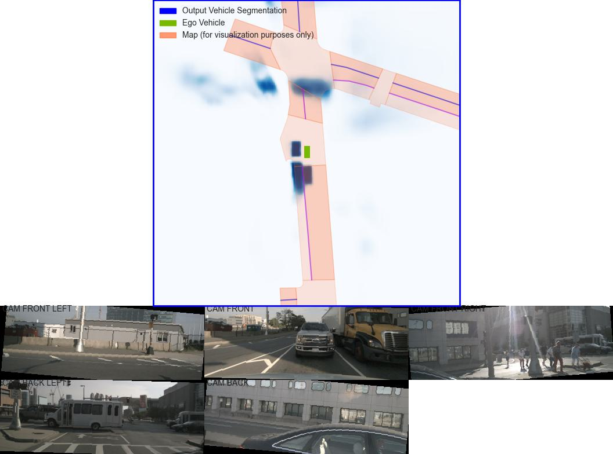
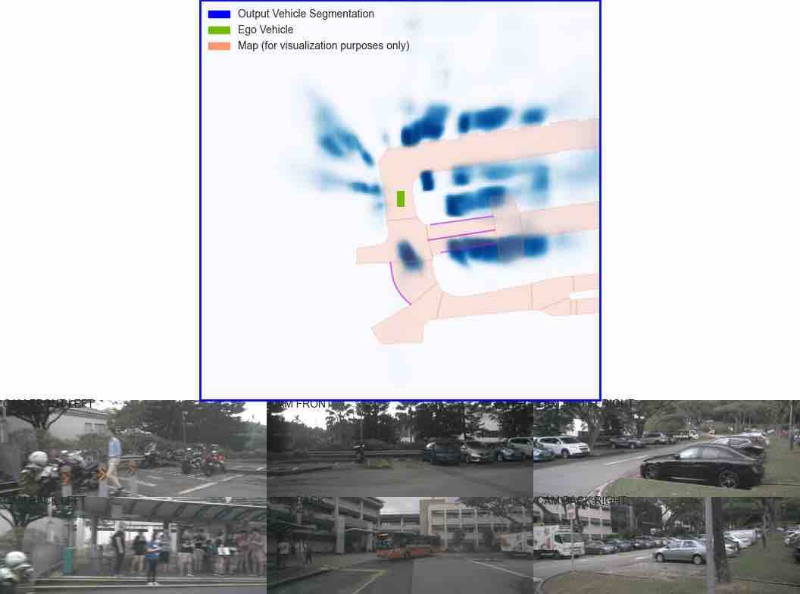
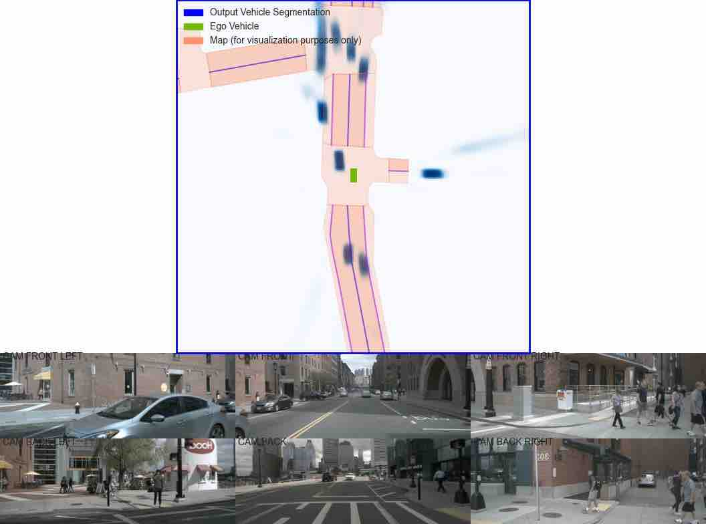
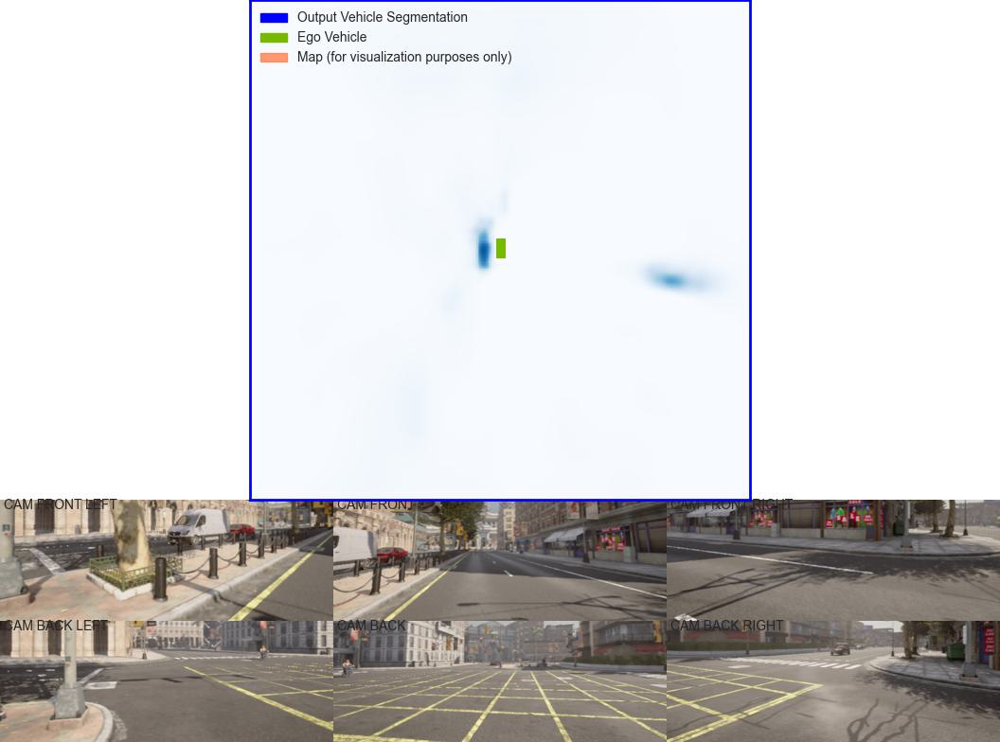

# DiffTransBEV

  

Generating optimized noise-free BEV representaiton of Autonomous Vehicles (Self-driving cars) using Stable Diffusion Transformers (DiTs), Diffusion Models, SwinV2 Transformers and Lift-Splat-Shoot.

  



## Installation

This project works best on:  
* Python 3.7

### Steps to recreate the environment

1. Create conda environment for the project
```
conda create --name av-bev python=3.7
conda activate av-bev
```
2. Install PyTorch  
```
conda install pytorch torchvision -c pytorch
```
